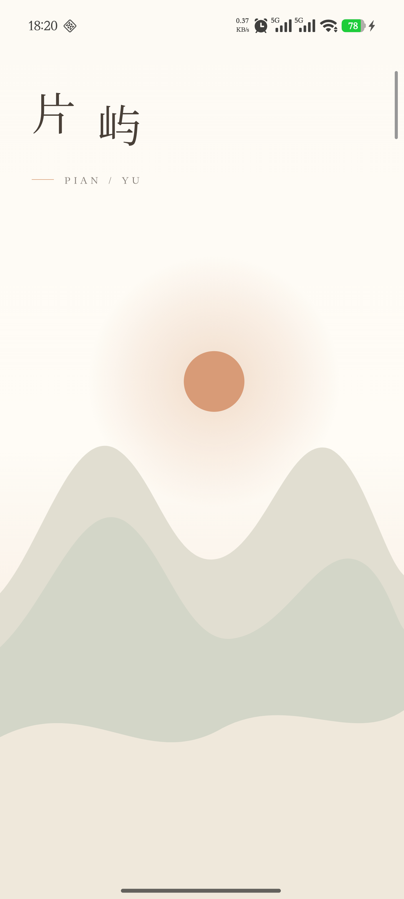

<div align="center">
  
  <h1>片屿 · Pianyu</h1>
  <p>把散落在手机里的照片，整理成一座座属于你的岛屿。</p>

  <p>
    
    
    
    
  </p>

  <p>
    <a href="https://github.com/jingkunxiong-crypto/Pianyu/releases/latest"><strong>下载最新版 APK</strong></a>
    ·
    <a href="PRIVACY.md">隐私说明</a>
    ·
    <a href="CHANGELOG.md">更新日志</a>
  </p>
</div>

---

## 关于片屿

片屿是一款以本地照片为中心的 Android 相册整理与轻量编辑应用。它使用系统媒体库读取你授权的照片，并提供“光册”、时间线、收藏、搜索和滤镜工具。照片内容不会因为使用片屿而上传到开发者服务器。

> 当前版本为早期预览版。Release 中提供的是使用 Android 调试证书签名的测试 APK，适合体验和测试，不代表 Google Play 正式发行版本。

## 功能亮点

| 功能 | 说明 |
| --- | --- |
| 光册整理 | 创建自定义光册，批量加入或移出照片；移出光册不会删除手机原文件。 |
| 时间线 | 按时间浏览系统媒体库中的照片。 |
| 收藏与搜索 | 收藏常看照片，并按照片信息快速检索。 |
| 本地编辑 | 调整亮度、对比度、饱和度、色温、褪色和暗角等参数。 |
| 滤镜二维码 | 保存、分享和扫描片屿滤镜码，也能识别支持的 Snapseed 二维码。 |
| Snapseed 联动 | 将照片交给已安装的 Snapseed 编辑，并在返回后检测新保存的图片。 |
| 精细权限 | 支持 Android 14+ 的“仅选择部分照片”访问方式。 |
| 隐私优先 | 整理信息保存在设备本地；应用禁用系统备份，不内置广告与账号系统。 |

## 视觉预览

<div align="center">
  
  <br />
  
</div>

## 安装

1. 打开 [Releases](https://github.com/jingkunxiong-crypto/Pianyu/releases/latest)。
2. 下载 `Pianyu-v1.0-preview.apk`。
3. 在 Android 设备上允许浏览器或文件管理器“安装未知应用”，然后打开 APK。
4. 首次启动时，按需授予照片访问权限；扫码功能仅在使用时请求相机权限。

系统要求：Android 7.0（API 24）或更高版本。

### 安装包校验

```text
SHA-256  B68B3C076E482E423E90C08CF91DA88A8D121E2F1704A1E305B3020899C63785
文件名   Pianyu-v1.0-preview.apk
大小     19,921,823 bytes
```

> 如果设备上已安装由不同证书签名的同包名版本，Android 会阻止覆盖安装。请先备份需要的数据并卸载旧版本，再安装此预览包。

## 权限说明

| 权限 | 用途 |
| --- | --- |
| 照片与媒体 | 显示、整理、编辑和导出用户授权的照片。 |
| 仅选择的照片 | 在 Android 14+ 上只访问用户明确选择的图片。 |
| 相机 | 扫描滤镜二维码；不使用扫码时不会调用相机。 |

更完整的信息见 [PRIVACY.md](PRIVACY.md)。

## 从源码构建

环境建议：Android Studio、JDK 11+、Android SDK 36。

```bash
git clone https://github.com/jingkunxiong-crypto/Pianyu.git
cd Pianyu
./gradlew testDebugUnitTest assembleDebug
```

Windows：

```powershell
.\gradlew.bat testDebugUnitTest assembleDebug
```

生成的 APK 位于 `app/build/outputs/apk/debug/app-debug.apk`。

## 质量状态

- Debug APK 构建通过。
- 27 个 JVM 单元测试通过，覆盖相册状态、照片库逻辑、编辑参数、滤镜二维码和权限状态。
- 项目采用 Kotlin、Jetpack Compose、Material 3、CameraX 与 ZXing。

## 项目结构

```text
app/src/main/java/com/example/newandroidapp/
├── data/          # 媒体库、光册状态与删除流程
├── domain/        # 照片库业务函数
├── editing/       # 编辑器、导出、滤镜码与 Snapseed 联动
├── permissions/   # 分版本照片权限处理
└── ui/            # Compose 页面、组件与主题
```

## 相关说明

- Snapseed 是可选的第三方应用，版权及服务由其权利人所有。
- 本仓库尚处于预览阶段，欢迎通过 Issues 报告可复现的问题。
- 发布历史见 [CHANGELOG.md](CHANGELOG.md)。


